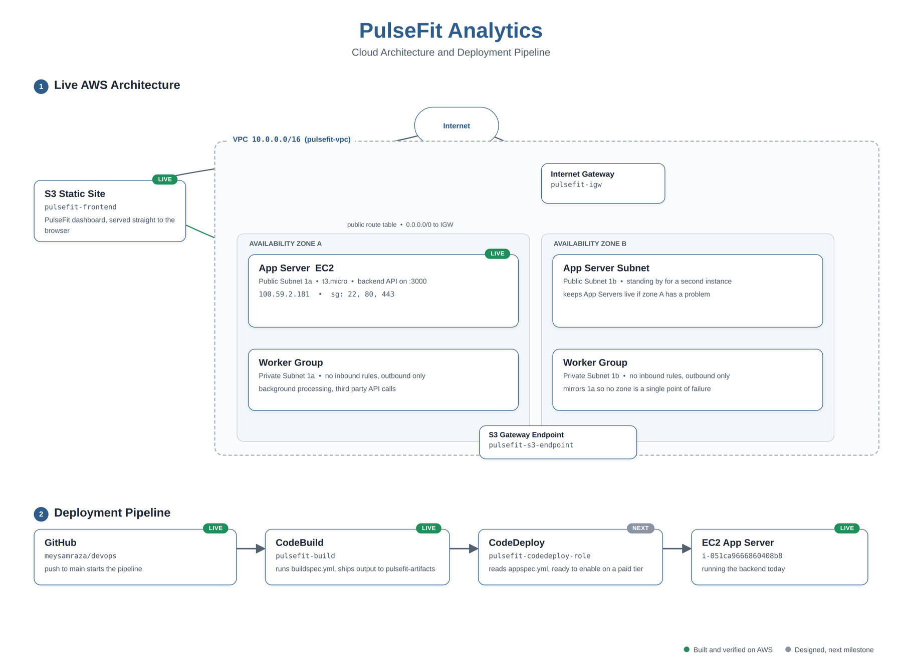
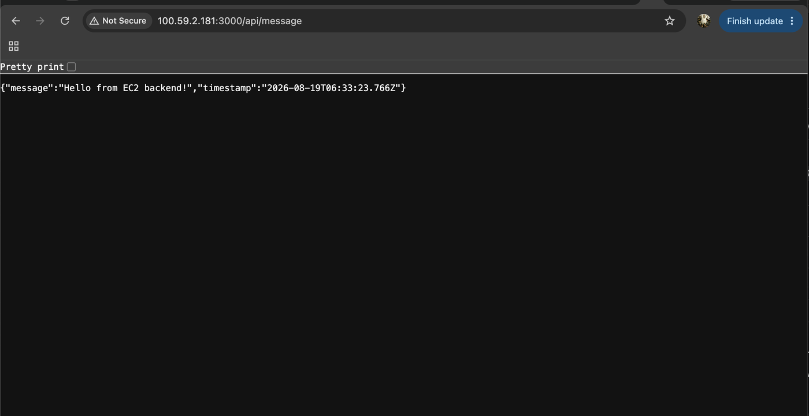
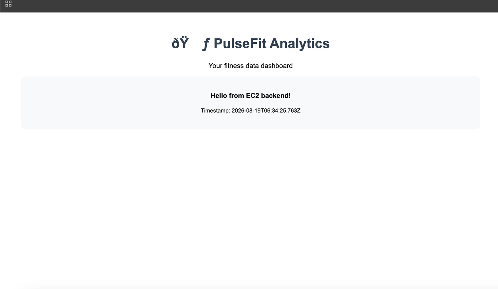

# ☁️ PulseFit Analytics | AWS Cloud Infrastructure

     

---

**A fitness wearable startup is running on one server that has already gone down three times this month. What does it actually take to fix that properly, not just patch it?**

An end to end AWS build, VPC through IAM through CodeBuild, done on live infrastructure rather than diagrammed on paper, with every step verified by screenshot along the way.

---

## 📋 Table of Contents

- [Project Overview](#-project-overview)
- [What This Demonstrates](#-what-this-demonstrates)
- [Architecture and Pipeline](#️-architecture-and-pipeline)
- [Technical Implementation](#️-technical-implementation)
- [Live Verification](#-live-verification)
- [Setup and Reproduction](#-setup-and-reproduction)
- [Project Structure](#-project-structure)
- [Contact](#-contact)

---

## 🔍 Project Overview

PulseFit Analytics needed to move off a single server before investors would take the platform seriously. The brief was concrete: no single point of failure, and a deployment pipeline that starts with a `git push` and ends without anyone touching a server by hand.

This repository is the build that answers that brief: a VPC spanning two Availability Zones, a backend API running on EC2, a frontend dashboard hosted on S3 that calls that backend live, IAM roles scoped per service, and a CodeBuild project reading `buildspec.yml` straight from this repo.

### 🛠 What This Demonstrates

**VPC design** — public and private subnets sized against real IP requirements, split across two Availability Zones
**Security boundaries** — one security group scoped to inbound web and admin traffic, one with zero inbound rules at all
**EC2 operations** — provisioning, SSH access, Node.js and the CodeDeploy agent installed and verified
**Static hosting** — S3 configured for public website hosting with a scoped bucket policy
**IAM least privilege** — a separate role per service (EC2, CodeBuild, CodeDeploy), each with only what it needs
**CI foundations** — CodeBuild wired directly to GitHub, reading `buildspec.yml`, shipping artifacts to S3

---

## 🏗️ Architecture and Pipeline



```text
GitHub (push to main)
  → CodeBuild (pulsefit-build, runs buildspec.yml)
  → build output → S3 (pulsefit-artifacts)
  → EC2 App Server (backend API, port 3000)
       ↑
S3 Static Site (pulsefit-frontend) → calls the EC2 API live
```

Two Availability Zones, two subnet tiers: public subnets carry the App Servers group with a security group open on 22, 80, and 443; private subnets carry the Worker group with no inbound rules at all, reachable only for outbound calls. A gateway VPC endpoint keeps S3 traffic inside the AWS network instead of routing it out to the public internet.

---

## ⚙️ Technical Implementation

### Network layout

| Layer | Detail |
|---|---|
| VPC | `10.0.0.0/16` |
| Public subnets | Two Availability Zones, /24 each, App Servers group |
| Private subnets | Two Availability Zones, /24 each, Worker group |
| Routing | Public route table → Internet Gateway; private route table stays local plus an S3 gateway endpoint |

### Security groups

```text
pulsefit-app-sg      inbound: 22 (admin), 80, 443       outbound: all
pulsefit-worker-sg    inbound: none                       outbound: all
```

The worker tier has no inbound rules at all, by design. Background processing never needs to be reached from outside, only to reach out.

### A moment worth noting

Two SSH attempts failed against the instance with a `No route to host` error before it became clear the address being used was stale, not that anything on the server side was broken. A small thing, but a good reminder to confirm the current public IP before assuming a failure is deeper than it is.

---

## ✅ Live Verification


The EC2 backend answering directly on its public IP with a live JSON response.


The S3 hosted dashboard loading and displaying that same response, confirming the frontend and backend are actually connected, not mocked.

---

## 🚀 Setup and Reproduction

This was built directly in the AWS console against a real account, not from a template. To reproduce the shape of it:

```bash
# 1. Clone this repo, it already has buildspec.yml and appspec.yml
git clone https://github.com/YOUR_USERNAME/devops.git
cd devops

# 2. Build the network
#    VPC 10.0.0.0/16 → two public + two private subnets across two AZs
#    → internet gateway → route tables → S3 gateway endpoint

# 3. Launch the backend
#    EC2 in a public subnet, pulsefit-app-sg attached
ssh -i your-key.pem ec2-user@<instance-public-ip>
curl -fsSL https://rpm.nodesource.com/setup_18.x | sudo bash -
sudo yum install -y nodejs
cd devops/backend && npm install && node server.js &

# 4. Host the frontend
aws s3 mb s3://your-frontend-bucket
aws s3 website s3://your-frontend-bucket --index-document index.html
aws s3 cp index.html s3://your-frontend-bucket/

# 5. Wire up CI
#    IAM roles for EC2, CodeBuild and CodeDeploy
#    CodeBuild project pointed at this repo, reading buildspec.yml
```

---

## 📁 Project Structure

```text
devops/
├── backend/                # Node.js API, listens on :3000
├── frontend/                # static site, deployed to S3
├── docs/
│   └── images/               # architecture diagram + verification screenshots
├── buildspec.yml             # read by CodeBuild
├── appspec.yml                # read by CodeDeploy
└── README.md
```

---

## 📬 Contact

- ✉️ **Email:** [i.sajeela.noor@gmail.com](mailto:i.sajeela.noor@gmail.com)
- 💼 **LinkedIn:** [Sajeela Noor](https://www.linkedin.com/in/sajeela-noor-82b510256)
- 🐙 **GitHub:** [p-u-p-x](https://github.com/p-u-p-x)
